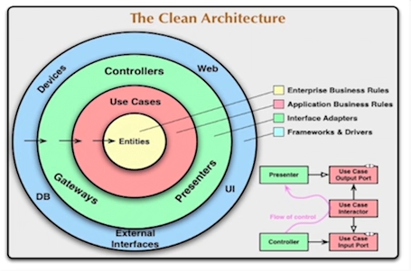
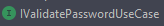
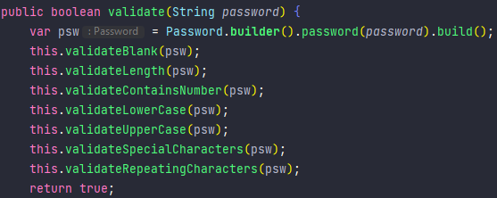

# Password Validator
A aplicação foi feita com SpringBoot para validar uma senha através de critérios pré-definidos.

## Frameworks

* JUnit - testes unitários
* Mockito - mockar serviços para auxílio no teste unitário
* Springboot - desenvolvimento

## Estrutura

* adapter - contém a pasta 'rest' onde estão presentes o controller, request, response e errorhandler
* entities - entidade e exception da entidade
* usecase - possui a exception do usecase e o próprio usecase conténdo todas as regras de negócio

* Optei por utilizar aaClean Architecture visando escrever um código com baixo acoplamento, alta coesão, altamente testável e que
  facilita a automação de testes num futuro hipotético

## Funcionamento

### Adapter

A camada do adapter convert por converter a chamada externa (POST) para um formato que o programa interprete.
Para a chamada do usecase, esta é feita através de uma interface presente na camada do usecase

### Entities
Onde está presente a entidade `Password`, que ja contém validações básicas e que será acessada pelo usecase. 

### Usecase
O caso de uso vai chamar a entidade e tranformá-la na variável interna `psw` para chamar todos os métodos de validação
da senha, e caso a senha seja válida, retornará `true`, caso contrário, retornará uma exception com a mensagem do critério
inválido.

##### Premissas

* Ao invés de usar um Regex para todas as validações, optei por utilizar um método para cada critério pois facilita não só
uma manutenção hipotética e o entendimento de todas as validações que estão sendo feitas, como também a adição e 
exclusão de qualquer validação

## Testes

Utilizei testes unitários para o caso de uso e integrados para o adapter, com uma cobertura de código de mais de 80% 
conforme o relatório do JacoCo feito através do comando 

## Como rodar a aplicação

Na pasta raíz, digitar o comando `mvn spring-boot:run`

